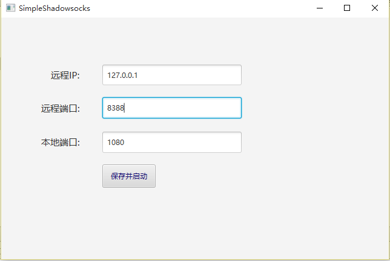

# socks5-item

------

使用netty4编写的一个类似于Shadowsocks软件，使用socks5协议，可做跳板使用。

> * socks5-client 为客户端
> * socks5-server 为服务器端

运行环境为jdk8.x,GUI使用了“java-fx”调试请下载SceneBuilder。

大部分源码来着于 [netty example](https://github.com/netty/netty)